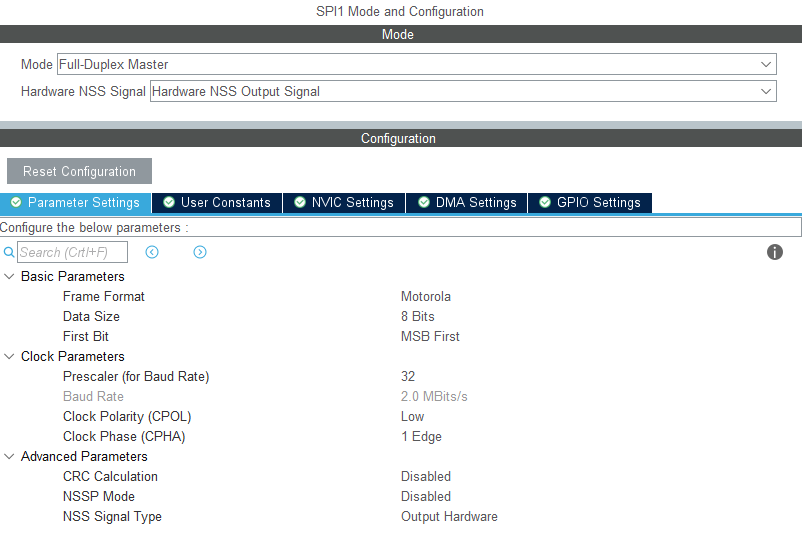
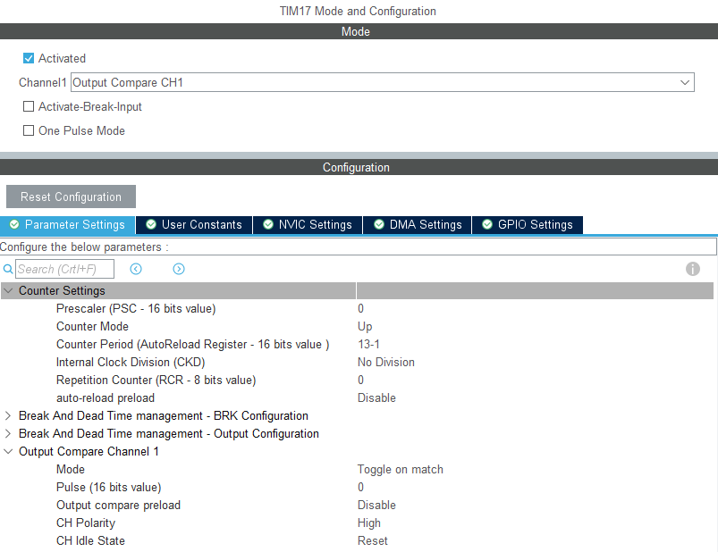
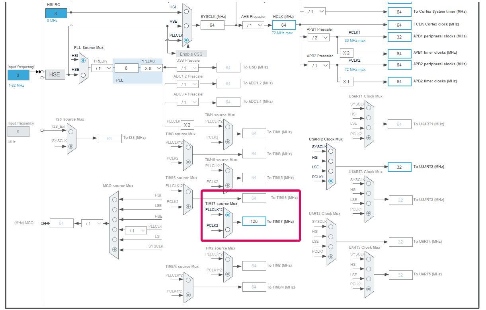
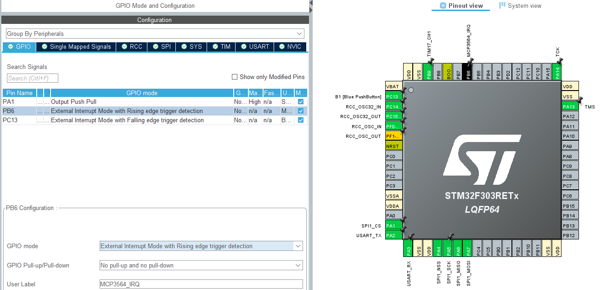

# Perpheral Configuration in STM32CubeMX

---

### SPI1

- use Motorola format to select "MSB first"

---

### TIM17

TIM17 must generate something close to 4.9152 MHz

- Prescaler = 0 --> `DIV1`
- Period = (13-1) --> `DIV13`
- Toggle on match --> `DIV2`

128 MHz / 1 / 13 / 2 = **4.9231 MHz**

---

### Clock for TIM17

---

### GPIO / IRQ

