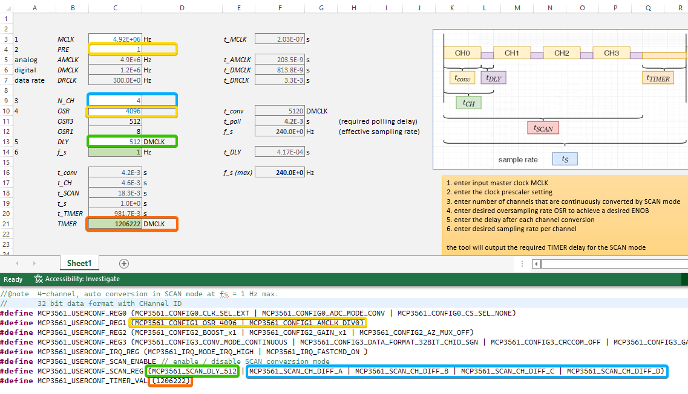

# MCP356x Library for STM32
C Library for configuring the MCP3561/2/4 1/2/4 channel 24 Bit sigma-delta ADC on STM32

---

The MCP356x is a highly versatile ADC with a relatively complex configuration scheme.
Becaue the chip is so highly configurable, this library does not necessarily reduce the time spent reading documentation.

- Microchip [Product Page](https://www.microchip.com/en-us/product/MCP3564)
- [Datasheet](https://ww1.microchip.com/downloads/aemDocuments/documents/MSLD/ProductDocuments/DataSheets/MCP3561-2-4-Family-Data-Sheet-DS20006181C.pdf)

**The user of this library must configure the chip** inside the `mcp3561_conf.h`-file.

---

### Sample Rate and Delay calculation vs. Resolution

See the Microsoft Excel file

**Example:**

The example above will automatically SCAN the four differential input channels. The total sample rate per channel shall be 1 Hz. (the internal sample rate is therefore 4 x 1 Hz = 4 Hz).
The external `4.915 MHz` clock is not divided (`1:1` / `PRE = DIV0 = 1`).
The oversampling rate (`OSR`) is chosen to be `4096` to achieve a maximum ENOB resolution of `22.7 bit` (see Datasheet, Table 2-2 no page 21 @ `GAIN = 1`).
Each sample per channel is spaced 512 digital clock cycles apart.
A remaining delay of `1206734` must be filled by the ADC. 

Playing around with this configuration also shows that the maximum achievable sample rate with 4 channels at `22.7 bit` resolution is approximately `59 Hz` (with `DLY = 0`).

If the sample rate needs to be higher, you can either lower the amount of channels or the resolution:
For example using an `OSR = 1024` (yielding an `ENOB = 20.2 bit`) would give a sample rate of `150 Hz` for all `4` channels. Or `300 Hz` when only `2` channels are sampled.

---

#### see also

- [jspark311/MCP356x-Breakout](https://github.com/jspark311/MCP356x-Breakout)
- [edmundsj/MCP3561DevBoard](https://github.com/edmundsj/MCP3561DevBoard)
- [nerdyscout/Arduino_MCP3x6x_Library](https://github.com/nerdyscout/Arduino_MCP3x6x_Library)
