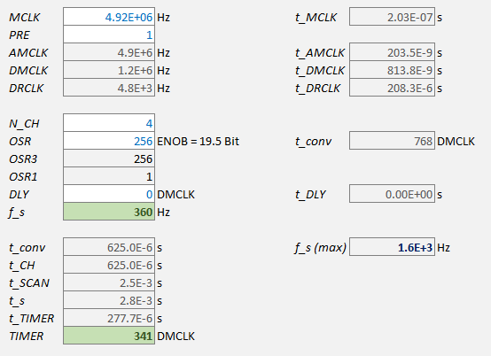

# MCP356x Library for STM32
C Library for configuring the MCP3561/2/4 1/2/4 channel 24 Bit sigma-delta ADC on STM32

---

The MCP356x is a highly versatile ADC with a relatively complex configuration scheme.
Becaue the chip is so highly configurable, this library does not necessarily reduce the time spent reading documentation.
The user of this library **must configure the chip** inside the `MCP3561_Init()`-function.

### sample rate and delay calculation

See the Microsoft Excel file

**Example:**

---

#### see also

- [jspark311/MCP356x-Breakout](https://github.com/jspark311/MCP356x-Breakout)
- [edmundsj/MCP3561DevBoard](https://github.com/edmundsj/MCP3561DevBoard)

